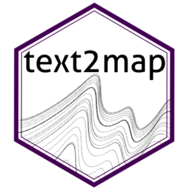

# [`text2map`](https://culturalcartography.gitlab.io/text2map/): R Tools for Text Matrices 

This is an R Package with libraries and utility functions for computational text analysis for the social sciences.

The functions are optimized for working with various kinds of **text matrices**. Focusing on the text matrix as the primary object -- which is represented either as a base `R` dense matrix or a `Matrix` package sparse matrix -- allows for a consistent and intuitive interface that stays close to the underlying mathematical foundation of computational text analysis. In particular, the package includes functions for working with word embeddings, text networks, and document-term matrices.

Related text datasets are available on GitLab in text2map.corpora and text dictionaries are available in text2map.dictionaries.

### Installation

Install the CRAN version:

```r
install.packages("text2map")
```

Or install the latest development version from GitLab:

``` r
library(remote)
install_gitlab("culturalcartography/text2map")
```

Get started with "Concept Mover's Distance by reading:

```r
vignette("CMDist-concept-movers-distance", package = "text2map")
```

### Related Packages

There are three related packages in development, and hosted on GitLab: 

- text2map.corpora: collection of text datasets
- text2map.dictionaries: collection of dictionaries, currently:
    - Sensorimotor Norms Dictionary for English, N = 40,000 (Lynott, et al. 2020)
    - Concreteness Dictionary for English, N = 40,000 (Brysbaert et al. 2014)
    - NRC Valence, Arousal, and Dominance Dictionary for English (Mohammad et al. 2018)
- text2map.theme: changes ggplot2 aesthetics and loads viridis color scheme

The above packages can be installed using the following:

```r
library(remote)
install_gitlab("culturalcartography/text2map.theme")
install_gitlab("culturalcartography/text2map.corpora")
install_gitlab("culturalcartography/text2map.dictionaries")
```

<!-- badges: start -->

[](https://cran.r-project.org/package=text2map)

[](https://gitlab.com/culturalcartography/text2map/-/commits/master)

[](https://gitlab.com/culturalcartography/text2map/-/commits/master)

[](https://www.repostatus.org/#wip)

[](https://opensource.org/licenses/MIT) 

[](https://cran.r-project.org/package=text2map)

<!-- badges: end -->
