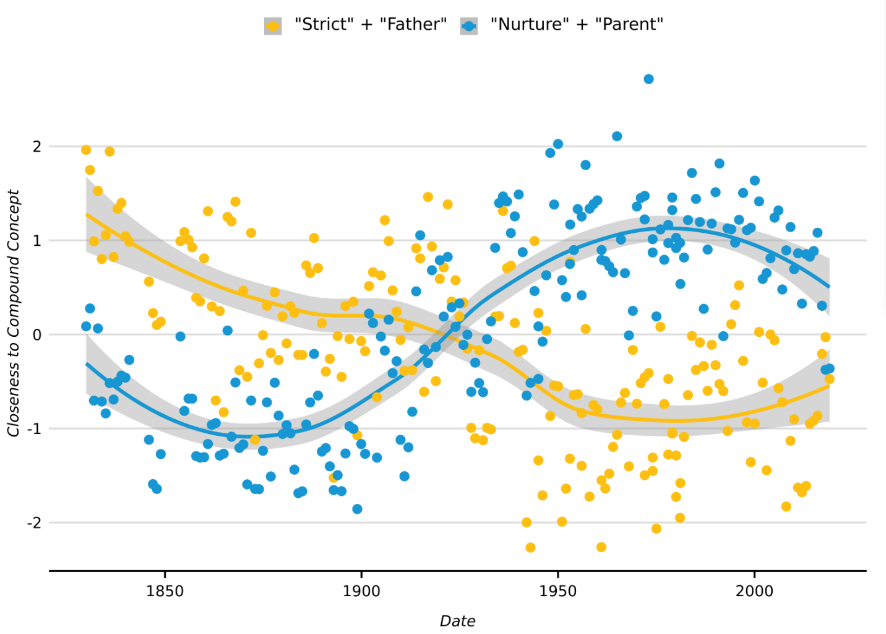

```{r, include = FALSE}
knitr::opts_chunk$set(
  collapse = TRUE,
  comment = "#>"
)
```

```{r, eval=TRUE, message=FALSE, out.width='85%', echo=FALSE}

```


### Citation

Stoltz, Dustin S., and Marshall A. Taylor. 2019. "Concept Mover's Distance." *Journal of Computational Social Science* 2(2):293-313.

```
@article{stoltz2019concept,
  title={Concept Mover's Distance},
  author={Stoltz, Dustin S and Taylor, Marshall A},
  journal={Journal of Computational Social Science},
  volume={2},
  number={2},
  pages={293--313},
  year={2019},
  publisher={Springer}
}
```

### Load `text2map`

Install and load the `text2map` package, and a few other supporting packages.
```{r, eval = FALSE, message = FALSE}

library(text2map)

library(text2vec)
library(gutenbergr)
library(tidyverse)
library(textclean)
library(stringi)

```

### Document-Term Matrix

To use the Concept Mover's Distance function (`CMDist`), you will need to transform your corpus into a document-term matrix (DTM). The preferred DTM is a sparse matrix in `Matrix` format (class "dgCMatrix") as output by `text2map`, `text2vec`, `Quanteda`, `udpipe`, and `tidytext`'s `cast_sparse` function, but we have tried to make the package accommodate DTMs made with the `tm` package (technically a "simple_triplet_matrix") or just a regular old base R dense matrix ([see this for a comparison of DTM creation methods](https://dustinstoltz.com/blog/2020/12/1/creating-document-term-matrix-comparison-in-r)). 

Here is a workflow with `text2map`'s super fast unigram DTM builder `dtm_builder()`.


```{r, eval = FALSE, message = FALSE}

data("meta_shakespeare")
# Grab the text from Project GUTENBERG
df_plays <- meta_shakespeare |>
  dplyr::select(gutenberg_id) |>
  gutenberg_download() |>
  group_by(gutenberg_id) |>
  summarize(text = paste(text, collapse = ", "))

```

Next, we will take care of some preprocessing. Make sure there are no special characters, remove punctuation, take care of curly quotes (which can be a pain), and then smooshing contractions. Finally, we'll remove any digits that might be floating around, and then make sure there is only a single space between words.

```{r, eval = FALSE}

df_plays <- df_plays |> mutate(
  ## transliterate and lowercase
  text = replace_curly_quote(text),
  text = stri_trans_general(text, id = "Any-Latin; Latin-ASCII"),
  text = tolower(text),
  ## punctuation
  text = gsub("(\\w+[_'-]+\\w+)|[[:punct:]]+", "\\1", text),
  text = replace_contraction(text),
  ## numbers and spaces
  text = gsub("[[:digit:]]+", " ", text),
  text = gsub("[[:space:]]+", " ", text),
  text = trimws(text)
)

```

Finally, we can convert the text of the plays into a DTM.

```{r, eval = FALSE}

dtm_plays <- df_plays |>
  dtm_builder(text, gutenberg_id)
```

###  Word Embedding Matrix

You will also need a matrix of word embedding vectors (with the "words" as rownames), and ultimately, `CMDist` is only as good as the word embeddings used. Word embedding vectors can be from a __pre-trained source__, for example:

* [Stanford NLP GloVe vectors](https://nlp.stanford.edu/projects/glove/)
* [fastText (Various) English word vectors](https://fasttext.cc/docs/en/english-vectors.html)
* [fastText Wiki and Common Crawl vectors for 294 languages](https://fasttext.cc/docs/en/pretrained-vectors.html)
* [HistWords: Word Embeddings for Historical Text](https://nlp.stanford.edu/projects/histwords/)
* [word2vec GoogleNews vectors](https://drive.google.com/file/d/0B7XkCwpI5KDYNlNUTTlSS21pQmM/edit?usp=sharing)
* [NLPL word embeddings repository](http://vectors.nlpl.eu/repository/)

It will take a little data wrangling to get these loaded as a matrix in `R` with rownames as the words (feel free to contact us if you run into any issues loading embeddings into `R`). 

You can also download these `R`-ready fastText English Word Vectors trained on the Common Crawl (crawl-300d-2M.vec) hosted on Dropbox: 

- [ft.cc.en.300D.2M.Rds (1.4 Gbs)](https://www.dropbox.com/s/ac4m9b16qnarabt/ft.cc.en.300D.2M.Rds?raw=1)

You can also use the [`text2map.pretrained`](https://culturalcartography.gitlab.io/text2map.pretrained/) package which hosts a few embeddings.

```{r eval = FALSE}

# install if necessary
remotes::install_gitlab("culturalcartography/text2map.pretrained")

library(text2map.pretrained)

# download once per machine
download_pretrained("vecs_fasttext300_wiki_news")

# load with data() once per session
data("vecs_fasttext300_wiki_news")

# it is a wordy, descriptive name, so you can rename it
my_wv <- vecs_fasttext300_wiki_news
rm(vecs_fasttext300_wiki_news)


```

Instead of pretrained embeddings, you can create your own embeddings trained locally on the corpus on which you are using `CMDist`. For example, the `text2vec` R package provides a nice [workflow for using the GloVe method to train embeddings](https://cran.r-project.org/package=text2vec/vignettes/glove.html). Pretrained embeddings are a simple way to get an analysis started, but researchers should always be critical about the corpus used to train these models.

One important caveat: the terms used to denote a concept or build a semantic direction need not be in the corpus, _but it must be in the word embeddings matrix_. If it is not, the function will stop and let you know. This means, obviously, that local corpus-trained embeddings cannot be used with words not in the corpus (pre-trained must be used). As the fastText method can be trained on "subword" character strings, it is possible to average the character strings that make up an out-of-vocabulary term.

## Measuring Conceptual Engagement

### Terms Denoting Focal Concepts

The most difficult and important part of using Concept Mover's Distance is selecting anchor terms. This should be driven by (a) theory, (b) prior literature, (c) domain knowledge, and (d) the word embedding space. One way of double-checking that selected terms are appropriate is to look at the term's nearest neighbors. Here we use the `sim2` function from `text2vec` to get the cosine distance between "thinking" and its top 10 nearest neighbors.

```{r, eval = FALSE}

cos_sim <- sim2(
  x = my_wv,
  y = my_wv["thinking", , drop = FALSE],
  method = "cosine"
)

head(sort(cos_sim[, 1], decreasing = TRUE), 10)
```

#### Single Word

Once you have a DTM and word embedding matrix, the simplest use of `CMDist` involves finding the closeness to a focal concept denoted by a _single word_. Here, we use the word "thinking" as our concept word ("cw"):

```{r, eval = FALSE}

doc_closeness <- CMDist(dtm = dtm_plays, cw = "thinking", wv = my_wv)
```

#### Compound Concepts

However, we may be interested in _specifying_ the concept with additional words: for example, we might want to capture "critical thinking." To handle this, it is as simple as including both words separated by a space in the quotes. This creates a pseudo-document that contains only "critical" and "thinking."

```{r, eval = FALSE}

doc_closeness <- CMDist(dtm = dtm_plays, cw = "critical thinking", wv = my_wv)
```

#### Ngrams

What if instead of a compound concept we are interested in a common concept represented with two words (i.e., a bigram)? First, just like with any other word, the ngram must be in the embedding matrix (the fastText pre-trained embeddings have a lot of n&ge;1 grams). Typically, ngrams are represented with an underscore or dash between the words. As long as the desired ngram is in the embeddings, the only difference for `CMDist` is that we'd include the underscore or dash (whichever is used), rather than a space, between words. In the fastText embeddings, the bigram is "critical-thinking":

```{r, eval = FALSE}

doc_closeness <- CMDist(dtm = dtm_plays, cw = "critical-thinking", wv = my_wv)
```

### Semantic Directions and Centroids

In the [original _JCSS_ paper](https://drive.google.com/file/d/1iLOVzNsdAetFiaychiJodL3BYTaTnqNl/view?usp=sharing), we discussed the "binary concept problem," where documents that are close to a concept with a binary opposite will likely also be close to both opposing poles. For example if a document is close to "love" it will also be close to "hate." But, very often an analyst will want to know whether a document is close to one pole or the other of this binary concept. To deal with this we incorporate insights from Kozlowski et al's (2019) paper ["Geometry of Culture"](https://doi.org/10.1177/0003122419877135) to define "semantic directions" within word embeddings -- i.e. pointing toward one pole and away from the other. We outline this procedure in more detail in a subsequent _JCSS_ paper ["Integrating Semantic Directions with Concept Mover's Distance to Measure Binary Concept Engagement"](https://drive.google.com/file/d/1UrO7pXem9X4hSzipNDgzGVQupEiPVApH/view?usp=sharing). 

The procedure involves generating a list of antonym pairs for a given binary concept -- that is, terms which may occur in similar contexts but are typically juxtaposed. Then we get the differences between these antonyms' respective vectors, and averaging the result (with `get_direction()`). The resulting vector will be the location of one "pole" of this binary concept, and `CMDist` calculates the distance each document is from this concept vector ("cv"). As this creates a one-dimensional continuum, documents that are far from this "pole" will be close to the opposing "pole."

```{r, eval = FALSE}
# first build the semantic direction:
additions  <- c("death", "casualty", "demise", "dying", "fatality")
substracts <- c("life", "survivor", "birth", "living", "endure")

pairs <- cbind(additions, substracts)
sd_death <- get_direction(pairs, my_wv)

# input it into the function just like a concept word:
doc_closeness <- CMDist(dtm = dtm_plays, cv = sd_death, wv = my_wv)

```

Instead of building a pseudo-document with several terms, as in the compound concept section above, one could also average several terms together to arrive at a "centroid" in the word embedding space -- this can be understood as referring to the center of a "semantic region." Again, `CMDist` will calculate the distance each document is from this concept vector ("cv").

```{r, eval = FALSE}
# first build the semantic centroid:
terms  <- c("death", "casualty", "demise", "dying", "fatality")

sc_death <- get_centroid(terms, my_wv)

# input it into the function just like a concept word:
doc_closeness <- CMDist(dtm = dtm_plays, cv = sc_death, wv = my_wv)

```

## Other Options and Considerations

### Multiple Distances at Once

An analysis might suggest multiple concepts are of interest, and so it is useful to get multiple distances at the same time. This, in effect, is adding more rows to our pseudo-document-term matrix. For example, in our _JCSS_ paper, we compare how Shakespeare's plays engage with "death" against 200 other concepts. `CMDist` also incorporate both concept words and vectors into the same run.

```{r, eval = FALSE}

# example 1
concept_words <- c("thinking", "critical", "thought")
doc_closeness <- CMDist(dtm = dtm_plays, cw = concept_words, wv = my_wv)

# example 2
concept_words <- c("critical thought", "critical-thinking")
doc_closeness <- CMDist(dtm = dtm_plays, cw = concept_words, wv = my_wv)

# example 3
concept_words <- c("critical thought", "critical-thinking")
terms  <- c("death", "casualty", "demise", "dying", "fatality")
concept_vectors <- get_centroid(terms, my_wv)
doc_closeness <- CMDist(dtm = dtm_plays, cw = concept_words, cv = concept_vectors, wv = my_wv)

```

### Performance and Parallel CMDist

Calculating `CMD` (as of version 0.5.0) relies on [Linear Complexity RWMD](https://arxiv.org/abs/1711.07227) or `LC-RWMD`. The performance gain over the previous `RWMD` implementation is considerable. Nevertheless, it may be desirable to boost performance further on especially large projects. 

One way to reduce complexity and thus time (without a noticeable drop in accuracy) is by removing very sparse terms in your DTM. Parallelizing is another option, so we built it in. To use parallel calculations just set `parallel = TRUE`. The default number of threads is 2, but you can set it as high as you have threads/cores.

```{r, eval = FALSE}
doc_closeness <- CMDist(dtm = dtm_plays, 
                      cw = "critical-thinking", 
                      wv = my_wv, 
                      parallel = TRUE, 
                      threads = 2)

```

### Scaling Output and Vector Comparison Metric

By default, the outputs are normalized using the `scale()` function in R. If this is not desired, set `scale = FALSE`.

```{r, eval = FALSE}
  
doc_closeness <- CMDist(dtm = dtm_plays, cw = "thinking", wv = my_wv, scale = FALSE)
                          
```

`CMDist` relies `text2vec` which currently uses __cosine__ as the distance metric to solve the underlying transportation problem. Kusner et al. (2015) and Atasu et al. (2017) papers used __Euclidean__ distance to compare word embeddings vectors. Cosine and Euclidean are mathematically similar (and in many cases identical). In all of our comparisons of Concept Mover's Distance using Euclidean and cosine the results were nearly identical.

### Note About Linear Complexity Relaxed Word Mover's Distance

Rather than the Relaxed Word Mover's Distance (RWMD) as discussed in Kusner et al's  (2015) "From Word Embeddings To Document Distances", `text2vec` uses the Linear-Complexity Relaxed Word Mover's Distance (LC-RWMD) as described by Atasu et al. (2017). LC-RWMD not only reduces the computational demands considerably, if we take the maximum of each document pair across the upper and lower triangles (i.e., the maximum of each [*i,j*]-[*j,i*] pair), the resulting symmetric distance matrix is precisely the same as the previous algorithm using Kusner et al's approach. As far as our tests have shown, the triangle corresponding to treating the pseudo-document as a "query" and the documents as a "collection" (see the [text2vec documentation](https://cran.r-project.org/package=text2vec), p. 28) will always return this set of maximums, and therefore there is no reason for the additional comparison step. If you have reason to believe this is not the case, please contact us and we will share the code necessary to reproduce results with the original Kusner et al. approach to check.

For more discussion of the math behind Concept Mover's Distance see Stoltz and Taylor (2019) "[Concept Mover's Distance](https://doi.org/10.1007/s42001-019-00048-6)" in the _Journal of Computational Social Science_
